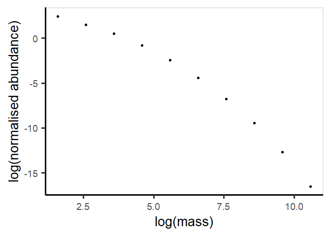
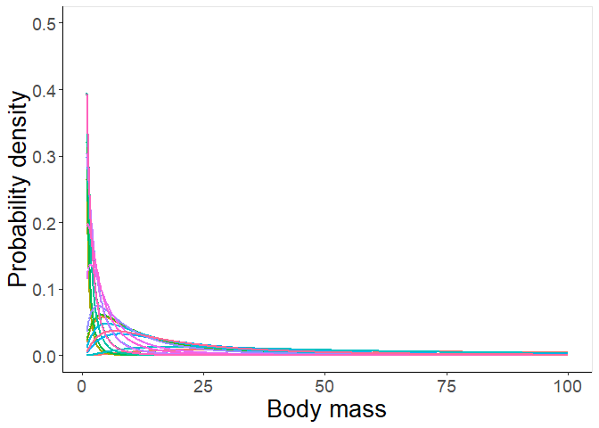

<!-- README.md is generated from README.Rmd. Please edit that file -->

# sbss </a>

<!-- badges: start -->
<!-- badges: end -->

## Overview

**S**pecies-**B**ased **S**ize **S**pectra (sbss) allows for the
construction of community-level empirical size spectra based on
species-level information, including in data-poor situations.

## Installation

``` r
# install.packages("devtools")
devtools::install_github("freddiejh/sbss")
```

## Usage

``` r
library(sbss)

# An example dataset
example_data
#> # A tibble: 20 x 3
#>   species_name         abundance site 
#>   <chr>                    <int> <chr>
#> 1 Margarites costalis          6 A    
#> 2 Hemimyzon khonensis          3 A    
#> 3 Tytthocope pygmaea           5 A    
#> 4 Pempheris schreineri         8 A    
#> 5 Cubaris invenustus           4 A    
#> # ... with 15 more rows

# Get asymptotic mass values for a list of species (column in dataframe or tibble)
example_data |> 
  find_lmax(spp_colname = "species_name", full_load = F)
#> # A tibble: 20 x 4
#>   species_name         abundance site   lmax
#>   <chr>                    <int> <chr> <dbl>
#> 1 Margarites costalis          6 A      5.07
#> 2 Hemimyzon khonensis          3 A      6.58
#> 3 Tytthocope pygmaea           5 A      8.47
#> 4 Pempheris schreineri         8 A     14.7 
#> 5 Cubaris invenustus           4 A      8.47
#> # ... with 15 more rows


# Get length-weight parameter (a, b) estimates for a list of species (column in dataframe or tibble)
example_data |> 
  find_lw(spp_colname = "species_name", full_load = F)
#> # A tibble: 20 x 5
#>   species_name         abundance site       a     b
#>   <chr>                    <int> <chr>  <dbl> <dbl>
#> 1 Margarites costalis          6 A     1.28    2.71
#> 2 Hemimyzon khonensis          3 A     0.0158  3.04
#> 3 Tytthocope pygmaea           5 A     0.0244  2.46
#> 4 Pempheris schreineri         8 A     0.0180  3.01
#> 5 Cubaris invenustus           4 A     0.0244  2.46
#> # ... with 15 more rows

# Estimate the lognormal parameters (meanlog and sdlog) based on the asymptotic mass of the species
example_data |> 
  find_lmax(spp_colname = "species_name", full_load = F) |> 
  find_lw(spp_colname = "species_name", full_load = F) |> 
  est_ssd(meanlog_eqn = \(m_max) 0.781*log(m_max) - 1.01,
          sdlog_eqn = \(m_max) 0.995)
#> # A tibble: 20 x 9
#>   species_name         abundance site   lmax      a     b   mmax meanlog sdlog
#>   <chr>                    <int> <chr> <dbl>  <dbl> <dbl>  <dbl>   <dbl> <dbl>
#> 1 Margarites costalis          6 A      5.07 1.28    2.71 105.     2.63  0.995
#> 2 Hemimyzon khonensis          3 A      6.58 0.0158  3.04   4.83   0.219 0.995
#> 3 Tytthocope pygmaea           5 A      8.47 0.0244  2.46   4.68   0.195 0.995
#> 4 Pempheris schreineri         8 A     14.7  0.0180  3.01  59.3    2.18  0.995
#> 5 Cubaris invenustus           4 A      8.47 0.0244  2.46   4.68   0.195 0.995
#> # ... with 15 more rows

# Calculate the community size spectrum based on the weighted summation of the species size distributions 
example_data |> 
  find_lmax(full_load = F) |> 
  find_lw(full_load = F) |> 
  est_ssd(meanlog_eqn = \(m_max) 0.781*log(m_max) - 1.01,
          sdlog_eqn = \(m_max) 0.995) |> 
  calc_css(group_var = "site")
#> # A tibble: 10 x 4
#> # Groups:   site [1]
#>   site      m norm_density density
#>   <chr> <dbl>        <dbl>   <dbl>
#> 1 A         3        5.47    10.9 
#> 2 A         6        2.86    11.4 
#> 3 A        12        1.42    11.3 
#> 4 A        24        0.578    9.25
#> 5 A        48        0.184    5.89
#> # ... with 5 more rows

# Plot the community size spectrum
example_data |> 
  find_lmax(full_load = F) |> 
  find_lw(full_load = F) |> 
  est_ssd(meanlog_eqn = \(m_max) 0.781*log(m_max) - 1.01,
          sdlog_eqn = \(m_max) 0.995) |> 
  calc_css(group_var = "site") |> 
  plot_css()
```



``` r
# Visualise the individual species size distributions
example_data |> 
  find_lmax(full_load = F) |> 
  find_lw(full_load = F) |> 
  est_ssd(meanlog_eqn = \(m_max) 0.781*log(m_max) - 1.01,
          sdlog_eqn = \(m_max) 0.995) |> 
  plot_ssd(legend = F) 
```



## Getting help

If you encounter a clear bug, please file an issue with a minimal
reproducible example on
[GitHub](https://github.com/FreddieJH/sbss/issues).

------------------------------------------------------------------------
